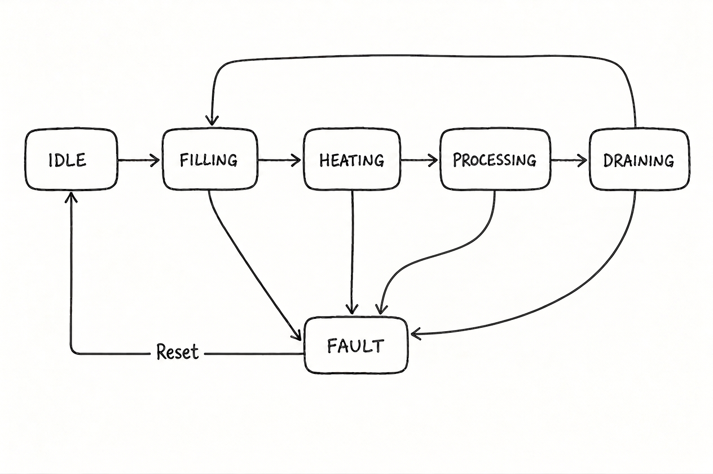
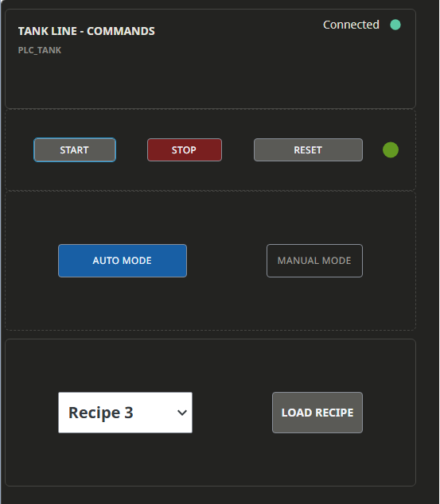
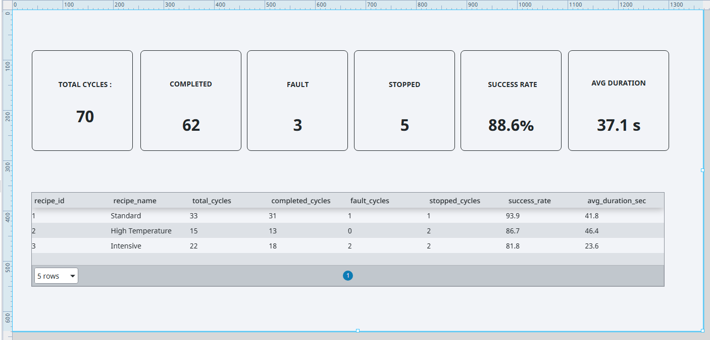

# plc-scada-batch-tank-system

---

## System Overview
A complete PLC-SCADA automation system developed for a simulated industrial batch tank process.

The system is designed as a modular automation architecture integrating a Siemens S7-1500 PLC with an Ignition Perspective SCADA application.

The project combines PLC-based process control, process simulation, SCADA supervision, historical data acquisition, production-cycle logging and KPI visualization.

## System Architecture

The system is organized into three main layers:

- **Control Layer** – PLC logic, state machine, recipe management and FAULT handling
- **Supervision Layer** – Ignition Perspective SCADA for process monitoring and operator interaction
- **Data Layer** – Historian and SQLite database for historical process data and production-cycle logging

  ---

# PLC Control

The PLC application was developed in Siemens TIA Portal V18 using a modular architecture based on Function Blocks and Data Blocks.

The control system manages the complete automatic batch sequence, including process supervision, actuator feedback, timeout detection, fault handling and recovery.

### Main Control Functions

- Automatic batch process control
- State Machine-based process management
- Recipe management
- Actuator feedback monitoring
- Timeout supervision
- FAULT handling
- Recovery logic

### State Machine

The process control is implemented using a dedicated State Machine for managing the different phases of the batch process.

  

### Fault Handling & Recovery
The PLC includes fault detection based on actuator feedback and timeout conditions, together with recovery logic to safely return the process to a defined state.

---
# Process Simulation

A dedicated Function Block was developed in TIA Portal to simulate the behaviour of the physical process.

The simulation allows the PLC control logic to be tested without physical hardware.

The simulated process includes:

- Tank level dynamics
- Temperature dynamics
- Actuator feedback delays
- Sensor and actuator faults

---
# SCADA – Ignition Perspective

Ignition Perspective provides the supervisory layer of the system, allowing operators to monitor and interact with the simulated process.

The SCADA application includes:

- Process visualization
- Operator commands
- Recipe management
- Alarm monitoring
- Real-time trends
- Historical data visualization

### Process Overview

  

### Operator Commands

  

### Alarms

  

---

# Production Data & KPI

Production cycles are logged in a SQLite database and used to generate production KPIs.

The production database records information such as:

- Cycle ID
- Recipe ID
- Start and end time
- Cycle duration
- Cycle result
- Alarm code

The SCADA dashboard provides a visual overview of production performance and cycle statistics.

  

---

# Historian

Ignition Historian is used to store and visualize historical process variables such as:

- Tank level
- Tank temperature

Historical data can be analyzed through the SCADA trend interface.

### Trends

  

  

---
