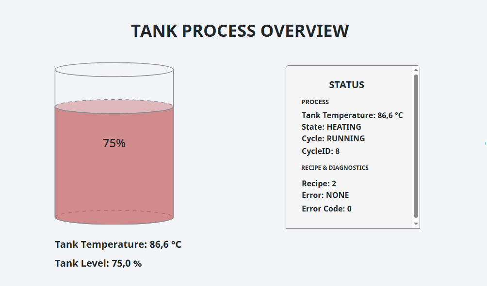

# plc-scada-batch-tank-system
# Industrial Batch Tank Automation System

A complete PLC-SCADA automation system developed for a simulated industrial batch tank process.

The project combines PLC-based process control, process simulation, SCADA supervision, historical data acquisition, production-cycle logging and KPI visualization.

---

## System Overview

The system is designed as a modular automation architecture integrating a Siemens S7-1500 PLC with an Ignition Perspective SCADA application.
# Industrial Batch Tank Automation System

A complete PLC-SCADA automation system developed for a simulated industrial batch tank process.

The project combines PLC-based process control, process simulation, SCADA supervision, historical data acquisition, production-cycle logging and KPI visualization.

---

## System Overview

The system is designed as a modular automation architecture integrating a Siemens S7-1500 PLC with an Ignition Perspective SCADA application.

  

## System Architecture

The system is organized into three main layers:

- **Control Layer** – PLC logic, state machine, recipe management and FAULT handling
- **Supervision Layer** – Ignition Perspective SCADA for process monitoring and operator interaction
- **Data Layer** – Historian and SQLite database for historical process data and production-cycle logging

  ---

# PLC Control

The PLC application was developed in Siemens TIA Portal V18 using a modular architecture based on Function Blocks and Data Blocks.

The control system manages the complete automatic batch sequence, including process supervision, actuator feedback, timeout detection, fault handling and recovery.

### Main Control Functions

- Automatic batch process control
- State Machine-based process management
- Recipe management
- Actuator feedback monitoring
- Timeout supervision
- FAULT handling
- Recovery logic

### State Machine

The process control is implemented using a dedicated State Machine for managing the different phases of the batch process.

  

### Fault Handling & Recovery

